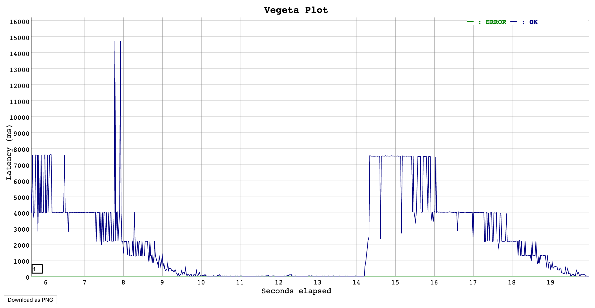

1. Starts a server at `localhost:9000`

2. Create query thread
3. Simulate server side work load (using python threading)
4. Server periodically heavy loaded for 5s and free for 5s

**Problems:**

1. If the computation time for request is low, the latency mainly comes from http communication

   => We want to amplify the computation latency caused by server load

   => Request latency will always benefit from fewer http requests

**TODOs**:

1. Monitor server side cpu load with respect to request latency, (Python CPU load should be high when latency is high) **@Saurabh  Goyal @Jingwu Xu**
2. Design different server load pattern for dummy workers (sin, cos, periodical) **@Rongrong Miao**
3. Think over more Load Balancing measurement matrix **@ALL**
4. Simulate network level constrains for load balancer, e.g. maximum connection limit, time out, server failure, and its implementation **@ALL**

**Meetings:**

1. **2/17  6:30 pm.** @Biomedical Library Building (BLB) Room 107